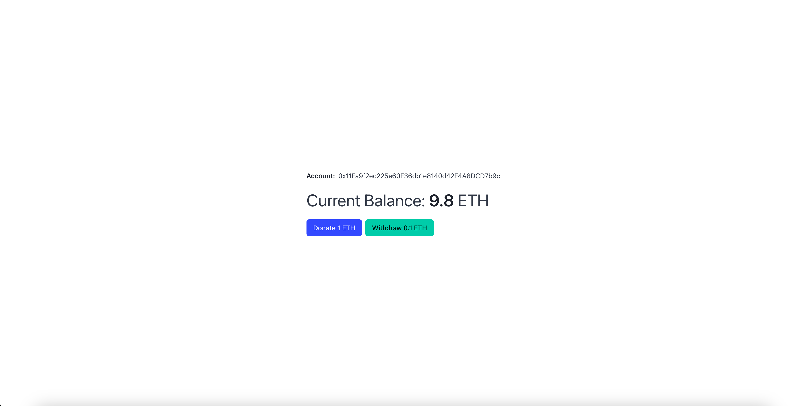

# Facuet dApp



<div align="center">
  
  
  
</div>

<p align="center" style="width: 90%; margin: 0 auto">
  My First <b>blockchain</b> app after having a deep understanding about <b>blockchain technologies</b>
  and after taking a deep course of <b>blockchain</b>, <b>ethereum</b>, <b>Solidity</b> and about
  blockchain development in general.
</p>

## 🔍 About dApp
Here you can find a huge starter information about the application also all used approaches in it for
deeping dive into blockchain development such as

- React App installation guidance, Node.js versions for development
- What is [Solidity](https://soliditylang.org/)
- All used approaches during development with [Solidity](https://soliditylang.org/) via a cheatsheet (right in this README)
- What are [Tuffle](https://archive.trufflesuite.com/) and [Ganache](https://archive.trufflesuite.com/ganache/) and how to install and initialize them

## 📦 Installation
Here you will get to know which Node.js, npm and yarn versions you need for running this project, also
how to install the project.

### Versions
- node v20.18.0
- npm v10.8.2
- yarn v1.22.22

1. Clone the repository
```bash
https://github.com/AlbertArakelyan/faucet-dapp.git
```

2. Install dependencies
```bash
yarn
```

3. Run the project
```bash
yarn start
```

### \* Depricatied package
There is a package for interacting with deployed smart contracts by truffle [@truffle/contract](https://www.npmjs.com/package/@truffle/contract) which is currently deprecated and I couldn't find an alternative for that, and this caused lot's Webpack errors and also fetching a `json` file caused as well.

For solving this problem I had to create [config-overrides.js](./config-overrides.js) file and add browserified versions of missing **Node.js packages**. More details about the fix you will find inside of [config-overrides.js](./config-overrides.js) file.

## Solidity
[Solidity](https://soliditylang.org/) is a programming language for developing Smart Contracts for interacting with blockchain, making crypto transfers and many other things.

## Used approaches in Solidity and cheatsheet
1. Mappings <br>
Mapping are kind of kind of converts to [key => value] pairs like `new Map()` in **Javascript** or maps in **Go**

2. Feild access type <br>
\- **private** -> can be accesible only within the smart contract <br>
\- **internal** -> can be accesible within the smart contract and also derived smart contract <br>
\- **public** -> can be called accessed inside of my smart contract and from outside

3. Function access types <br>
\- **external functions** -> cannot be called outside of my smart contract <br>
\- **public functions** -> can be called inside of my smart contract and from outside <br>
\* *external should be used for functions when you expect them to be called from outside, and public when you expect them to be called from inside*

4. Function types <br>
**pure**, **view** - are read-only call. The opposite of this are function which create **Transactions**. **Transaction** (can generate state changes) and require gas fee.
\- **view** - it indicates that the function will not alter the storage statee in any way <br>
\- **pure** - even more strict, indicating that it won't even read the storage state <br>
\* *with this keyword I can even call external functions, but gas pricess will be higher*

5. "receive()" special function <br>
The [receive()]() function is a special function. It's called when you make a tx (transaction) that doesn't specify function name to call. <br>
External functions are part of the contract interface which means they can be called via contracts and other txs (transactions).

6. "override" addition to the function
override is also a key word which we define next to the function name when we declare the funcion. <br>
**override** -> we overridee its definition from abstract contract <br>
\* *Example of abstract contract* - [Logger.sol](./contracts/Logger.sol)

7. Modifiers <br>
Modifiers are special function which defined next to the name of declared function and they check a certain condition and after satisfying that condition the origianlly declared function will be executed. <br>
Example of a modifier is [limitWithdraw]() modifier. <br>
*Note that [_]() (underline) is required at the end of the body of modifier because it is the body of the function that executed after modifier check e.g. [withdraw()]().*

8. Blocks <br>
Block info <br>
**Nonce** - a hash when combined with the minHash proofs that the block has gone through proof of work (PoW)

9. JSON-RPC <br>
To talk to the node in network you can make JSON-RPC http calls. Read here about JSON-RPC: [https://ethereum.org/en/developers/docs/apis/json-rpc](https://ethereum.org/en/developers/docs/apis/json-rpc/)